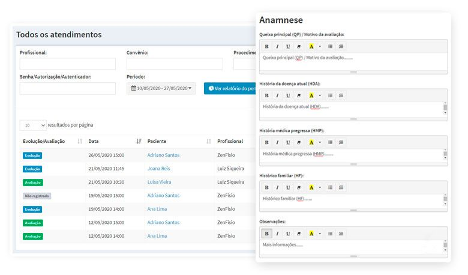
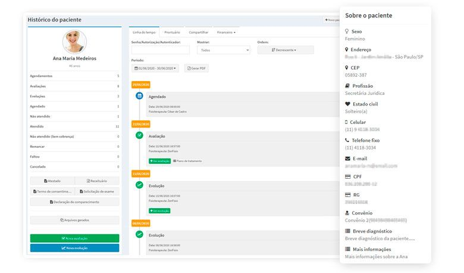

# Grupo B Fisioterapia 🔪
Trabalho Final de banco de dados de estruturação de uma aplicação médica:

## Projeto Sistema de Fisio

### Grupo B

### Integrantes:
Juliano C. Felipe - [@julianocfelipe](https://github.com/julianocfelipe) 
Charles Clezar- [@CharlesClezar](https://github.com/julianocfelipe) 
Pedro Hahn - [@pedrohahn](https://github.com/pedrohahn) 
William Fabre - [@FabrWill](https://github.com/FabrWill) 
Hebrom Junior - [@hebromjunior](https://github.com/hebromjunior) 
Lucas Borges Borba - [@lucasborba111](https://github.com/lucasborba111) 
Paulo Cesar Dal Ponte - [@pauloDalponte](https://github.com/pauloDalponte) 
Pedro Guedez - [@Pedroguedez](https://github.com/Pedroguedez) 

### Modelo Físico:
Disponível aqui [dbdiagram.io](https://dbdiagram.io/d/648b9d0d722eb774940d197b) 
Arquivo fonte: <code>link pro arquivo</code> 
<code>Imagem</code>
  
### Dicionário de Dados:
<code>Excel ou tabela do Github (markdown)</code>

### Scripts DDL Criação do Database:
Banco de dados utilizado SQL Server versão 2022 - Azure. 
<code>1 arquivo SQL por objeto</code>

### Scripts Popula tabelas:
Banco de dados utilizado SQL Server versão 2022 - Azure. 
<code>1 arquivo SQL por objeto</code>

### Objetos de BD (stored procedure, triggers e functions):
<code>1 arquivo SQL por objeto</code>
  
### Código do sistema:
Linguagem  
<code>código fonte da aplicação</code>

